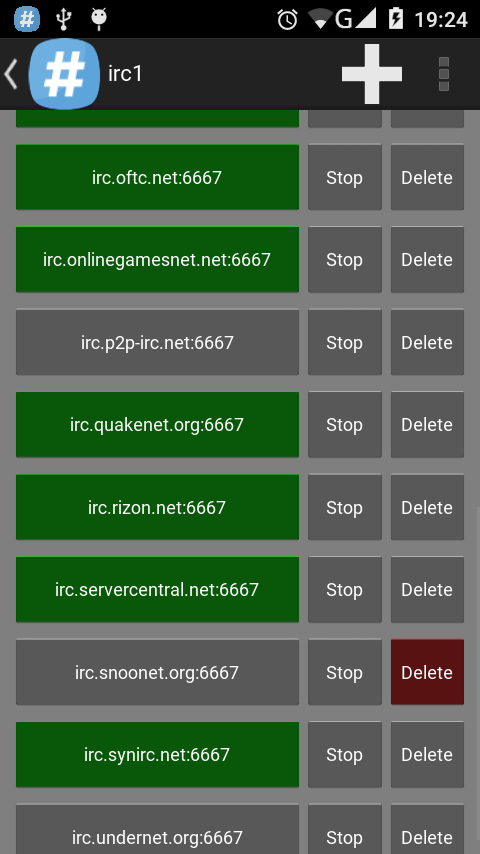
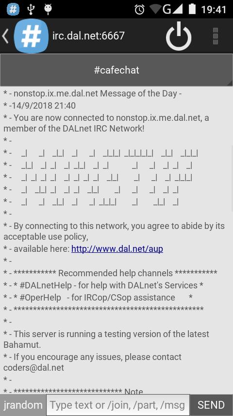
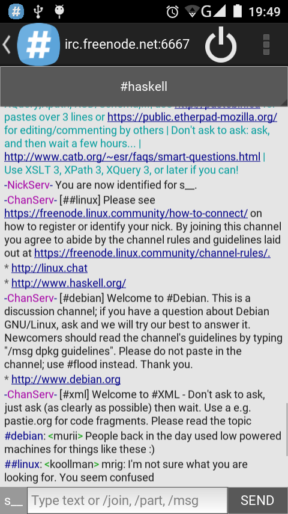

# Project: irc1

Android IRC client using python-for-android

## Build requirements

- python 2
- kivy
- python-for-android

## How to use

- Use **plus** (+) button on main screen to add server
- Tap on server name to connect
- Select channel in dropdown menu
- Type message in text box
- Use a **slash** (/) to send special commands
- Long press on server to edit
- Use "Stop" button to stop receiving messages
- Tap "Delete" button **twice** to remove server

## Features

- Automatic authentication and joining channels
- Active on multiple servers/channels at the same time
- Receive messages when app in background or screen turned off
- Color coded message components and clickable URLs
- One touch connect/disconnect

  

## Authors

USTH ICT BI7 students
